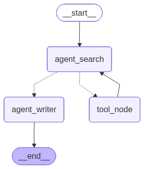

# 🚀 AI Content Generator

Sistema de geração automatizada de conteúdo para redes sociais usando agentes de IA com LangGraph.


## 📋 Sobre

Plataforma que combina **LangGraph**, **LangChain** e **LLMs** para criar conteúdo otimizado para redes sociais através de um workflow multi-agente:

1. **Agente de Pesquisa** → Busca informações via Tavily API
2. **Agente de Escrita** → Gera conteúdo estruturado baseado na pesquisa

Suporta 4 formatos: **Carousel**, **Description**, **Stories** e **Video**.

---

## ✨ Features

- ✅ Workflow multi-agente com LangGraph
- ✅ Pesquisa web avançada (Tavily)
- ✅ Geração estruturada via Pydantic
- ✅ 6 tons de voz personalizáveis
- ✅ API REST completa (FastAPI)
- ✅ Interface web moderna e responsiva
- ✅ Suporte a múltiplos LLMs (Groq/OpenAI/Cerebras)

---

## 🛠️ Stack Técnica

**Backend:**
- Python 3.11+
- FastAPI
- LangGraph + LangChain
- Pydantic v2
- Tavily (pesquisa web)

**LLMs Suportados:**
- Cerebras 
- Groq 
- OpenAI 

**Frontend:**
- HTML5 + CSS3 (Custom Design System)
- Vanilla JavaScript
- Google Fonts (DM Sans + JetBrains Mono)

---

## 📦 Instalação

### Pré-requisitos
```bash
Python 3.11+
pip
virtualenv (recomendado)
```

### 1. Clone o repositório
```bash
git clone https://github.com/Gab-Angel/AI_Content_Generate.git
cd AI_Content_Generate
```

### 2. Crie ambiente virtual
```bash
python -m venv venv
source venv/bin/activate  # Linux/Mac
# venv\Scripts\activate   # Windows
```

### 3. Instale dependências
```bash
pip install -r requirements.txt
```

### 4. Configure variáveis de ambiente
```bash
cp .env.example .env
```

Edite `.env`:
```env
CEREBRAS_API_KEY=sua_chave_aqui
TAVILY_API_KEY=sua_chave_aqui

# Opcional (se usar outros LLMs)
GROQ_API_KEY=sua_chave_aqui
OPENAI_API_KEY=sua_chave_aqui
```

**Obtenha as chaves:**
- Cerebras: [cloud.cerebras.ai](https://cloud.cerebras.ai)
- Tavily: [tavily.com](https://tavily.com)

---

## 🚀 Uso

### Iniciar servidor
```bash
python run.py
```

Acesse: **http://localhost:8000**

### API Endpoints

#### `POST /api/generate`
Gera conteúdo para redes sociais.

**Request:**
```json
{
  "type_post": "carousel",
  "topic": "Inteligência Artificial",
  "idea": "Como IA está transformando pequenos negócios",
  "tone": "professional",
  "slides": 5
}
```

**Response:**
```json
{
  "success": true,
  "research": {
    "summary": "...",
    "key_points": ["...", "..."],
    "sources": ["https://..."],
    "insights": ["..."]
  },
  "content": {
    "type_post": "carousel",
    "title": "5 Formas que IA Revoluciona Seu Negócio",
    "texts": ["Hook...", "Slide 2...", "..."],
    "caption": "Transforme seu negócio com IA...",
    "hashtags": "#IA #EmpreendedorismoDigital #Automacao"
  }
}
```

#### `GET /api/health`
Health check do sistema.

---

## 📊 Arquitetura

### Workflow LangGraph



### Stack
```
┌─────────────┐
│   Frontend  │  (HTML/CSS/JS)
└──────┬──────┘
       │ HTTP
┌──────▼──────┐
│  FastAPI    │  (REST API)
└──────┬──────┘
       │
┌──────▼──────────────────────┐
│      LangGraph Workflow     │
│  ┌────────────────────────┐ │
│  │  1. Agente de Pesquisa │ │
│  │     ↓ (Tavily API)     │ │
│  │  2. Tool Node          │ │
│  │     ↓                  │ │
│  │  3. Estruturação       │ │
│  │     ↓                  │ │
│  │  4. Agente de Escrita  │ │
│  └────────────────────────┘ │
└─────────────────────────────┘
```

### Fluxo de Execução
1. **User Input** → Frontend envia payload
2. **Search Agent** → Cria query e chama `web_search`
3. **Tool Node** → Executa Tavily API
4. **Search Agent (2ª exec)** → Estrutura resultado em `ResearchResult`
5. **Writer Agent** → Gera `FinalReport` baseado na pesquisa
6. **Response** → Frontend renderiza resultados

---

## 🎨 Tipos de Conteúdo

| Formato | Características | Uso Ideal |
|---------|----------------|-----------|
| **Carousel** | 3-10 slides progressivos | Tutoriais, listas, storytelling |
| **Description** | Post único expandido | Reflexões, anúncios, artigos curtos |
| **Stories** | 5 cards rápidos | Dicas rápidas, teasers, engajamento |
| **Video** | Roteiro 15-60s | Reels, TikTok, YouTube Shorts |

### Tons Disponíveis
- `professional` → Corporativo, dados
- `educational` → Didático, passo-a-passo
- `confident` → Assertivo, comandos
- `friendly` → Casual, acessível
- `inspirational` → Motivacional, emocional
- `serious` → Urgente, factual

---

## 🔧 Customização

### Trocar LLM
Edite `src/agent/agents.py`:
```python
# Opção 1: Groq
llm = ChatGroq(
    model="llama-3.3-70b-versatile",
    api_key=os.getenv("GROQ_API_KEY"),
    temperature=0
)

# Opção 2: OpenAI
llm = ChatOpenAI(
    model='gpt-4o-mini',
    api_key=os.getenv("OPENAI_API_KEY"),
    temperature=0
)
```

### Ajustar Prompts
Edite arquivos em `src/prompts/`:
- `prompt_search.py` → Comportamento da pesquisa
- `prompt_writer.py` → Estilo do conteúdo gerado

---

## 📁 Estrutura do Projeto
```
ai-content-generator/
├── api/
│   ├── __init__.py
│   └── main.py              # FastAPI app
├── frontend/
│   ├── css/style.css        # Design system
│   ├── js/app.js            # Client logic
│   └── index.html
├── src/
│   ├── agent/
│   │   └── agents.py        # Search & Writer agents
│   ├── graph/
│   │   ├── nodes.py         # Nós do workflow
│   │   ├── states.py        # Pydantic schemas
│   │   ├── tools.py         # Tavily integration
│   │   └── workflow.py      # LangGraph setup
│   └── prompts/
│       ├── prompt_search.py
│       └── prompt_writer.py
├── .env.example
├── requirements.txt
├── run.py                   # Entry point
└── README.md
```

---

## 🧪 Melhorias Futuras

- [ ] Suporte a imagens (DALL-E/Stable Diffusion)
- [ ] Templates customizáveis
- [ ] Histórico de gerações
- [ ] Export direto para Canva/Figma
- [ ] Análise de performance de posts
- [ ] Multi-idioma

---

## 📝 Licença

MIT License - veja [LICENSE](LICENSE) para detalhes.

---

## 🤝 Contribuindo

1. Fork o projeto
2. Crie sua branch (`git checkout -b feature/MinhaFeature`)
3. Commit suas mudanças (`git commit -m 'Add: nova feature'`)
4. Push para a branch (`git push origin feature/MinhaFeature`)
5. Abra um Pull Request

---

## 📧 Contato

- GitHub: [@Gab-Angel](https://github.com/Gab-Angel)
- LinkedIn: [Gabriel Angel](https://www.linkedin.com/in/gabriel-angel-9277663a0)

---

<div align="center">
  
**Desenvolvido com ⚡ por Gabriel Angel**

</div>